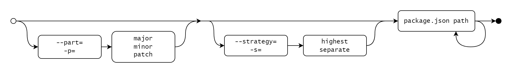

# bump-versions

Bump the version of multiple package.json and package-lock.json files at the same time

## Installation

```
npm i --save-dev bump-versions
```

## Examples

### Bump the patch version to the highest found versions in any of the specified package.json files

```
npx bump-versions --part=patch --strategy=highest ./package.json ./client/package.json ./server/package.json
```

result:
* ./package.json 1.0.0 => 5.2.1
* ./client/package.json 2.3.4 => 5.2.1
* ./server/package.json 5.2.0 => 5.2.1

### Bump each of the package.json files minor version separately

```
npx bump-versions --part=minor --strategy=separate ./package.json ./client/package.json ./server/package.json
```

result:
* ./package.json 1.0.0 => 1.1.0
* ./client/package.json 2.3.4 => 2.4.0
* ./server/package.json 5.2.0 => 5.3.0

## Options

-p, --part      Which part of the version do you want to bump.  [choices: "major", "minor", "patch"] [default: "patch"]


-s, --strategy  Which strategy to use for determining the version. [choices: "highest", "separate"] [default: "separate"]
                    "highest"
                        Will find the highest version in all the files, and bump that version, then apply that version to all files.
                    "separate"
                        Will bump the version of each file separately.  


-h, --help      Show help  [boolean]
--version       Show version number  [boolean]


